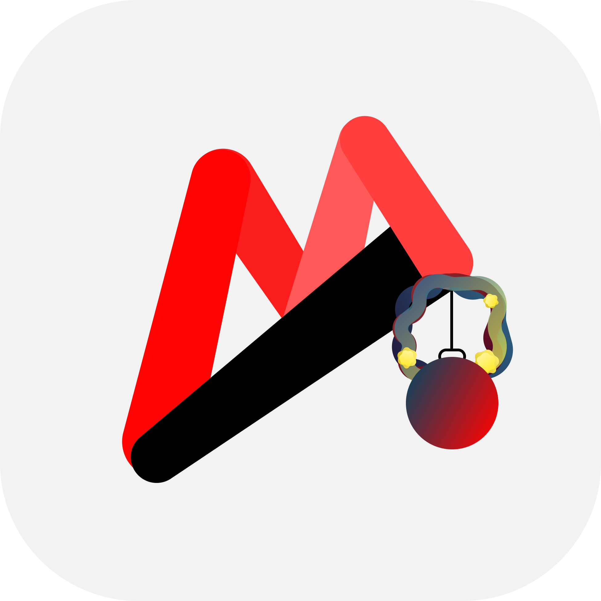

# Above Music

A production application deployed on Google Play with a lifecycle of approximately two years. This timeline includes 1.5 years of development and 6 months of active maintenance, resulting in 40+ updates. Beyond standard music player features, the system functions as a cloud-integrated platform with authentication, and an integrated monetization

  

### Features

Engineered to deliver a superior UX, the application integrates media player features with a custom token economy, authentication, and a news feed. The interface features system-wide animations and an interactive guide, supported by optimized search and sorting algorithms for songs management

 

**Tech Stack:**  
Java, XML, ExoPlayer, Media3, MediaStore API, Foreground Service, Firebase (Auth, Realtime DB, Storage, Crashlytics), Multithreading, DataStore, RxJava, Google Cloud OAuth 2.0, MediaMetadataRetriever, AnimatedVectorDrawable, Android Animations API

 

<h3>
  <a href="https://www.youtube.com/watch?v=VMenfoXS1x8">
    Video
  </a>
</h3>

 

![Beta_1.png]{}

 

### Remake
Since February 2024, initiated a rewrite to improve scalability. Migrated from a Java monolith to Clean Architecture + MVVM, implementing a functional media core and reactive UI with Kotlin and Jetpack Compose before the project was frozen.

 

Tech Stack:
Kotlin, Jetpack Compose, Clean Architecture, MVVM, ExoPlayer, MediaStore API, Coroutines, Flow, AnimatedVectorDrawable

 

![Alpha_1.png]{}

